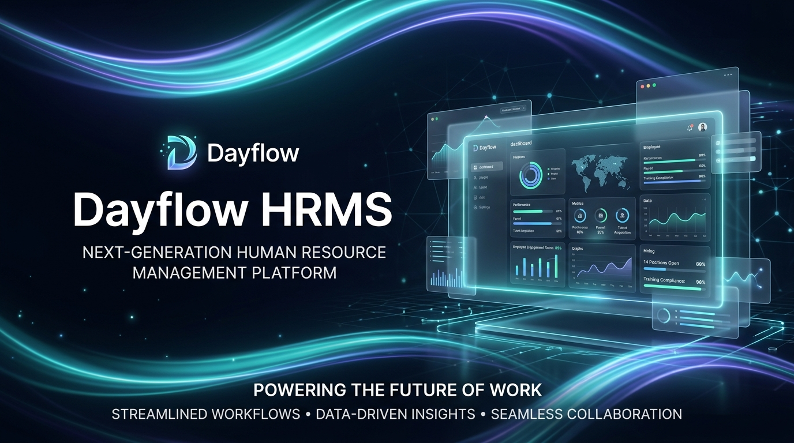
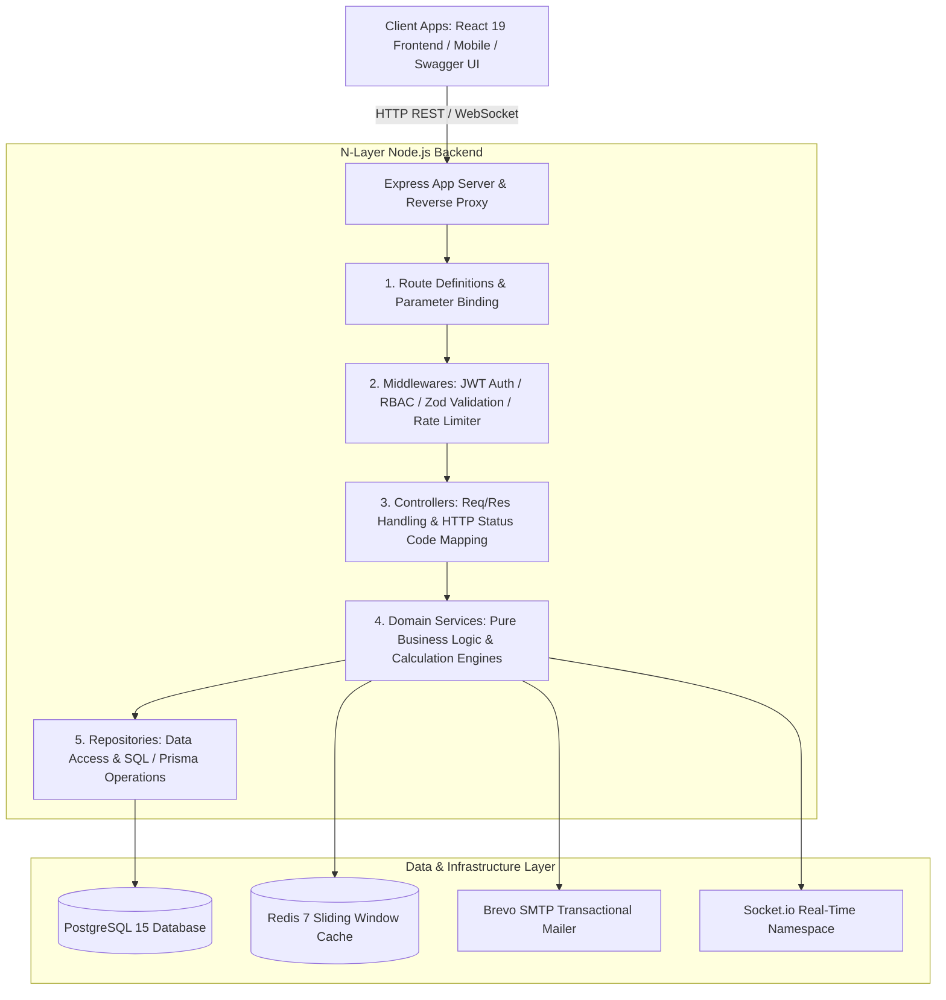

# Dayflow V0.1HRMS — Next-Generation Enterprise Workforce Platform

<div align="center">



[](https://opensource.org/licenses/Apache-2.0)
[](https://nodejs.org)
[](https://www.postgresql.org)
[](https://www.prisma.io)
[](https://redis.io)
[](https://www.docker.com)
[](http://makeapullrequest.com)

</div>

**Dayflow HRMS** is an enterprise-grade, full-stack Human Resource Management System engineered with strict **N-Layer architecture**, **PostgreSQL 15**, **Prisma ORM**, and a reactive **React 19** frontend. It eliminates administrative toil by unifying identity provisioning, digital timecard tracking, atomic leave workflows, Indian statutory **50/50 payroll calculations**, and real-time executive analytics into a single high-performance platform.

---

##  Table of Contents
- [ Desktop Application (Windows Installer)](#-desktop-application-windows-installer)
- [ Key Capabilities & Features](#-key-capabilities--features)
- [ System Architecture](#%EF%B8%8F-system-architecture)
- [ Technology Stack](#%EF%B8%8F-technology-stack)
- [ Getting Started](#-getting-started)
  - [Desktop App (Ready to Install)](#-desktop-app-ready-to-install)
  - [Prerequisites](#prerequisites)
  - [Quickstart with Docker](#quickstart-with-docker)
  - [Manual Local Setup](#manual-local-setup)
- [ Seeded Demo Accounts](#-seeded-demo-accounts)
- [ API Reference & Documentation](#-api-reference--documentation)
- [ Usage & Code Examples](#-usage--code-examples)
- [ Repository Directory Structure](#-repository-directory-structure)
- [ Strategic Roadmap](#%EF%B8%8F-strategic-roadmap)
- [ Contributing](#-contributing)
- [License](#-license)

---

## 🖥️ Desktop Application (Windows Installer)

DayFlow HRMS is available as a native **Windows Desktop Application** with an embedded auto-starting backend server and full offline support.

| Distribution | Format | Description |
| :--- | :--- | :--- |
| **Windows Setup Wizard** | `.exe` (NSIS) | `DayFlow HRMS Setup 1.0.0.exe` — Full installation wizard with desktop & start menu shortcuts. |
| **Portable Version** | `.exe` (Standalone) | `DayFlow HRMS 1.0.0.exe` — Portable standalone executable ready to run anywhere without installation. |

> 💡 **Download**: Grab the latest desktop installer directly from the [GitHub Releases](../../releases) section!

### Building Desktop App from Source:
```bash
# Build production Windows installer and portable .exe
npm run desktop:build

# Run desktop app in hot-reload development mode
npm run desktop:dev
```


---

## ✨ Key Capabilities & Features

### 1.  Split-Screen Aurora Authentication & Wireframe Identity Provisioning
* **Dual-Token JWT Security**: 15-minute access tokens paired with 7-day cryptographically stored refresh tokens, cookie-parser, and sliding window rate limiting (10 requests / 15 min via Redis).
* **Automated Login ID Engine**: Strict algorithmic ID generation (`[Prefix][Initials][Year][Serial]`, e.g., `OITKASU0220001`) with automatic credential delivery via Brevo SMTP relay.
* **Granular Role-Based Access Control (RBAC)**: Enforces least-privilege security between `ADMIN`, `HR`, and `EMPLOYEE` roles, preventing unauthorized access to sensitive financial records.

### 2. Real-Time Digital Timecard & Attendance Derivation
* **One-Click Check-In / Check-Out Terminal**: Immutable timestamp capture with geo/work-mode contextual tagging.
* **Automated Overtime & Work Hours**: Real-time evaluation against standard 8-hour workday schedules, calculating exact decimal work hours and overtime derivation.
* **3-State Dynamic Status**: Live organization-wide derivation of `Present` , `On Leave` , and `Absent` .

### 3. Atomic Time-Off & Multi-Type Leave Workflows
* **Comprehensive Leave Categories**: Paid Time Off (PTO), Sick Leave, Casual Leave, and Unpaid Leave.
* **Atomic Database Transactions**: Approving a leave atomically invokes a PostgreSQL transaction (`BEGIN...COMMIT`) that creates corresponding `Attendance` records.
* **Leave Balances & Quota Auditing**: Transparent balance accounting connected to monthly payroll deductions.

### 4. Statutory 50/50 Indian Payroll Calculation Engine
* **Automated CTC Breakdown**: Strict compliance with Indian payroll norms:
  * **Basic Salary**: Exactly 50% of monthly gross wage.
  * **House Rent Allowance (HRA)**: Exactly 50% of basic salary (25% of gross wage).
  * **Standard Allowances & Performance Bonus**: Structured allowances with dynamic balancing into **Fixed Allowance**.
  * **Statutory Deductions**: 12% Employee EPF, 12% Employer EPF, and ₹200 Professional Tax.
* **Attendance Multipliers**: Integrates unpaid leave multipliers to compute pro-rated gross earned wage and net payable amounts.
* **PDFKit Payslip Streaming**: Instant binary PDF generation (`/api/v1/payroll/:id/slip`) with itemized allowances and tax breakdowns.

### 5.  Executive Analytics & Real-Time Telemetry
* **Real-Time KPI Metric Cards**: Live database aggregations of Total Headcount, Active Check-Ins, Approved Leaves, and Total Payouts.
* **Interactive Recharts Visualizations**: Categorical breakdown of department workforce distribution and leave utilization.
* **WebSocket Alerts**: Event-driven notifications via Socket.io (`/notifications` namespace).

---

## 🏛️ System Architecture

Dayflow enforces a strict **N-Layer separation of concerns** with zero cross-layer bleeding. Business logic is strictly prohibited from living in controllers or routes.



---

## 🛠️ Technology Stack

| Layer | Technology | Purpose / Specification |
|---|---|---|
| **Frontend Framework** | React 19 + Vite 6 | Lightning-fast HMR and component rendering |
| **Styling & Icons** | Tailwind CSS + Lucide Icons | Responsive aurora glassmorphism & neo-pastel palette |
| **State & Data Fetching**| TanStack Query v5 + Zustand | Optimistic mutations, cached server state, and global stores |
| **Backend Runtime** | Node.js 20 LTS (ES Modules) | High-throughput asynchronous REST API |
| **Web Framework** | Express 4.19 | HTTP routing, middleware pipeline, and cookie parsing |
| **Database & ORM** | PostgreSQL 15 + Prisma ORM | Relational data persistence with relational schema constraints |
| **In-Memory Cache** | Redis 7 + In-Memory Fallback | Sliding window rate limiting & session caching |
| **Real-Time Engine** | Socket.io 4.7 | Dual-direction `/notifications` WebSocket namespace |
| **Document Streaming** | PDFKit | Server-side programmatic PDF payslip generation |
| **Transactional Email** | Nodemailer + Brevo SMTP | Automated onboarding credentials & leave alert delivery |
| **API Specification** | Swagger UI + OpenAPI 3.0 | Interactive API documentation at `/api-docs` |
| **Containerization** | Docker & Docker Compose | Multi-container PostgreSQL and Redis orchestration |

---

## 🚀 Getting Started

### Prerequisites
- **Node.js**: v18.0.0 or higher (`v20 LTS` recommended)
- **npm**: v9.0.0 or higher
- **PostgreSQL**: v15.0+ (or use Docker)
- **Redis**: v7.0+ (optional; in-memory fallback included)

---

### Quickstart with Docker

1. **Clone the repository**:
   ```bash
   git clone https://github.com/naveencmy/DataFlow_V0.1.git
   cd DayFlow_V0.1
   ```

2. **Launch PostgreSQL & Redis**:
   ```bash
   cd backend
   docker compose up -d
   ```

3. **Configure environment & seed database**:
   ```bash
   cp .env.example .env
   npm install
   npm run seed
   npm run dev
   ```

4. **Launch Frontend (in another terminal)**:
   ```bash
   cd ../frontend
   npm install
   npm run dev
   ```
   Open **`http://localhost:5173`** in your browser.

---

## 👥 Seeded Demo Accounts

The database comes pre-seeded with **10 Indian Tamil workforce profiles** across all departments:

| Role | Employee Name | Login ID / Email | Location | Default Password |
|---|---|---|---|---|
| 👑 **Administrator / HR** | **Kavitha Balasubramanian** | `admin@dayflow.internal` | Chennai HQ, Taramani | `Dayflow@123` or `admin123` |
| 💻 **Lead Frontend Architect** | **Karthik Sundaram** | `karthik.sundaram@dayflow.internal` (`OITKASU0220001`) | Chennai Tech Hub | `Dayflow@123` or `employee123` |
| 📋 **People Operations Lead** | **Ananya Ramaswamy** | `ananya.ramaswamy@dayflow.internal` (`OITANRA0220002`) | Chennai Tech Hub | `Dayflow@123` or `employee123` |
| 🎯 **Senior Product Manager** | **Senthil Murugan** | `senthil.murugan@dayflow.internal` (`OITSEMU0220003`) | Coimbatore Hub | `Dayflow@123` or `employee123` |
| 🎨 **Principal UX Designer** | **Dinesh Rajendran** | `dinesh.rajendran@dayflow.internal` (`OITDIRA0220005`) | Madurai Campus | `Dayflow@123` or `employee123` |
| 📊 **Senior Tax & Payroll Lead**| **Meenakshi Loganathan**| `meenakshi.loganathan@dayflow.internal` (`OITMELO0220006`) | Chennai HQ | `Dayflow@123` or `employee123` |
| ☁️ **DevOps Cloud Architect** | **Vignesh Natarajan** | `vignesh.natarajan@dayflow.internal` (`OITVINA0220007`) | Chennai Tech Hub | `Dayflow@123` or `employee123` |

---

## 📡 API Reference & Documentation

Interactive OpenAPI 3.0 documentation is accessible at:
👉 **`http://localhost:5000/api-docs`**

```http
POST   /api/v1/auth/login                  # Authenticate and receive dual JWTs
POST   /api/v1/auth/signup                 # Provision new user and employee profile
GET    /api/v1/employees                   # List employees with search and pagination
GET    /api/v1/employees/:id               # Retrieve single employee profile
PUT    /api/v1/employees/:id/salary        # Update 50/50 salary structure (Admin only)
POST   /api/v1/attendance/checkin          # Digital check-in with timestamp
PUT    /api/v1/attendance/checkout         # Digital check-out and overtime calculation
GET    /api/v1/attendance/today            # Retrieve today's organization attendance summary
POST   /api/v1/leaves                      # Submit leave request
PUT    /api/v1/leaves/:id/review           # Approve/Reject leave with atomic attendance sync
POST   /api/v1/payroll/process             # Run idempotent monthly payroll calculation batch
GET    /api/v1/payroll/:id/slip            # Stream binary PDF payslip document
GET    /api/v1/analytics/dashboard         # Executive KPI summary metrics
```

---

## 💡 Usage & Code Examples

### 1. Indian 50/50 CTC Payroll Calculation Engine
```javascript
import { computeLivePayroll, buildDefaultSalaryComponents } from './src/shared/utils/salaryEngine.js';

// Define employee compensation structure
const monthlyGrossWage = 85000;
const components = buildDefaultSalaryComponents(monthlyGrossWage);

// Compute live pro-rated payroll factoring in attendance & unpaid leaves
const payrollResult = computeLivePayroll(
  { monthlyWage: monthlyGrossWage, components },
  22, // Total working days in month
  2,  // Unpaid leave days
  0   // Unapproved absent days
);

console.log(payrollResult);
/*
Output:
{
  totalWorkingDays: 22,
  payableDays: 20,
  grossMonthlyWage: 85000,
  grossEarnedWage: 77273,
  deductions: { employeePF: 5100, professionalTax: 200, totalDeductions: 5300 },
  netPayable: 71973
}
*/
```

---

## 📂 Repository Directory Structure

```text
DayFlow_V0.1/
├── backend/                        # Production Node.js N-Layer REST API
│   ├── docker-compose.yml          # PostgreSQL 15 & Redis 7 containers
│   ├── prisma/
│   │   ├── schema.prisma           # Prisma relational schema definitions
│   │   └── seed.js                 # Database seeder (10 Indian Tamil employees)
│   ├── src/
│   │   ├── config/                 # Env validation, PostgreSQL pool, Redis, Logger
│   │   ├── modules/
│   │   │   ├── auth/               # JWT authentication & session management
│   │   │   ├── employee/           # Profile CRUD, RBAC, salary structures
│   │   │   ├── attendance/         # Check-in/out, work hours & overtime
│   │   │   ├── leave/              # Leave requests & atomic transactions
│   │   │   ├── payroll/            # Idempotent batch payroll & PDF streaming
│   │   │   ├── notification/       # Real-time WebSocket notifications
│   │   │   └── analytics/          # KPI metrics & department distribution
│   │   ├── shared/
│   │   │   ├── errors/             # Domain AppError hierarchy
│   │   │   ├── middlewares/        # JWT auth, RBAC, validation, rate limiting
│   │   │   └── utils/              # Salary engine, ID generator, PDFKit
│   │   ├── app.js                  # Express application setup
│   │   └── server.js               # Server bootstrap & graceful shutdown
│   └── tests/                      # Jest & self-contained test suites
├── frontend/                       # Modern React 19 + Vite Application
│   ├── src/
│   │   ├── api/                    # Axios API service clients
│   │   ├── components/             # Reusable UI components (auth, tables, modals)
│   │   ├── hooks/                  # TanStack Query custom data fetching hooks
│   │   ├── pages/                  # Dashboard, Attendance, Leave, Payroll, Reports
│   │   ├── stores/                 # Zustand global authentication and UI state
│   │   └── utils/                  # Client-side derivations and validators
│   └── vite.config.js              # Vite bundler configuration
├── docs/
│   └── assets/                     # Architecture diagrams & hero banner
├── CONTRIBUTING.md                 # Open-source contribution guidelines
├── LICENSE                         # Apache 2.0 License
└── README.md                       # Comprehensive project documentation
```

---

## 🗺️ Strategic Roadmap

- [x] **Phase 1**: Core N-Layer backend architecture with PostgreSQL 15 & Prisma ORM.
- [x] **Phase 2**: Dual-token JWT security, Redis rate limiting, and RBAC guards.
- [x] **Phase 3**: Indian 50/50 statutory payroll engine & PDFKit payslip downloads.
- [x] **Phase 4**: Atomic leave approvals and live attendance derivation.
- [x] **Phase 5**: Executive analytics dashboards with Recharts.
- [ ] **Phase 6**: Biometric IoT device integration (ZKTeco / Face Recognition).
- [ ] **Phase 7**: Multi-currency international payroll slabs & global tax compliance.

---

## 🤝 Contributing

Contributions make the open-source community an incredible place to learn, innovate, and build. Please review our [CONTRIBUTING.md](./CONTRIBUTING.md) guide before opening issues or pull requests.

1. **Fork the Project**
2. **Create your Feature Branch** (`git checkout -b feat/AmazingFeature`)
3. **Commit your Changes** (`git commit -m 'feat: add amazing enterprise capability'`)
4. **Push to the Branch** (`git push origin feat/AmazingFeature`)
5. **Open a Pull Request**

---

## 📄 License

Distributed under the **Apache License 2.0**. See [`LICENSE`](./LICENSE) for full details.

---

<div align="center">
  <sub>Engineered with precision for the modern enterprise by the <b>Dayflow Engineering Team</b>.</sub>
</div>
