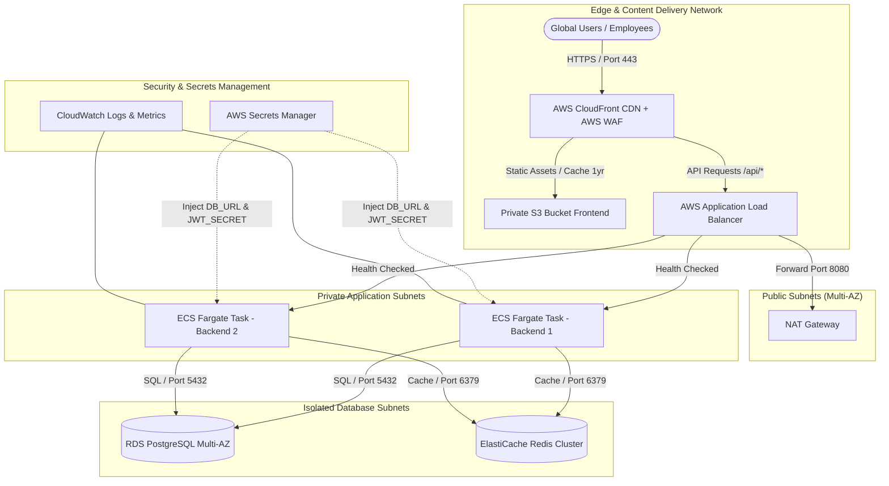

# Dayflow HRMS — Enterprise DevOps & Cloud Infrastructure

[](https://docs.docker.com/compose/)
[](https://aws.amazon.com/ecs/)
[](https://www.terraform.io/)
[](https://github.com/features/actions)
[](https://prometheus.io/)
[](https://redis.io/)

An enterprise-grade, GitOps-aligned cloud infrastructure and automated CI/CD architecture for **Dayflow HRMS**. Built with zero-trust network segmentation, multi-stage non-root containerization, edge rate limiting, Prometheus observability, automated database backups, and Infrastructure-as-Code (Terraform).

---

## 🏛️ High-Level System Architecture



---

## 📦 Directory Structure

```
d:/HRMS/
├── .github/
│   └── workflows/
│       ├── ci.yml                          # GitHub Actions CI: Lint, Test, Docker Build & Trivy Scan
│       └── deploy.yml                      # GitHub Actions CD: Migration, ECS Deployment, Health Probe & Rollback
├── docker-compose.yml                      # Local multi-container topology (app, web, db, redis, migrate)
├── docker-compose.prod.yml                 # Production multi-container topology with Certbot SSL
├── nginx/
│   ├── nginx.conf                          # Enterprise edge reverse proxy & rate limiter
│   └── conf.d/
│       └── default.conf                    # Virtual host, SPA fallback, API proxy & SSL challenge
├── infra/
│   ├── docs/
│   │   └── runbooks.md                     # SRE Runbooks: RPO 24h, RTO 1h, Rollback & Snapshot Recovery
│   └── terraform/                          # AWS Infrastructure as Code (IaC)
│       ├── main.tf                         # Provider configuration & backend setup
│       ├── variables.tf                    # Infrastructure variables
│       ├── vpc.tf                          # Multi-AZ VPC, Subnets & Security Groups
│       ├── ecs.tf                          # ECS Fargate Cluster, Task Definitions, ALB & Auto-scaling
│       ├── rds.tf                          # RDS PostgreSQL Multi-AZ with automated backups
│       ├── redis.tf                        # ElastiCache Redis Cluster
│       ├── s3_cloudfront.tf                # Private S3 Bucket, CloudFront CDN & OAC
│       ├── waf.tf                          # AWS WAF Web ACL (SQLi, XSS, Rate Limits)
│       ├── secrets.tf                      # Secrets Manager & IAM least-privilege roles
│       ├── outputs.tf                      # Resource URIs and DNS outputs
│       └── terraform.tfvars.example        # Sample environment values
├── backend/                                # REST API microservice (Node.js 20 + Express + Mongoose/Postgres + Redis)
│   ├── Dockerfile                          # Multi-stage non-root container (Node.js 20 Alpine)
│   ├── package.json                        # Pinned dependencies (prom-client, ioredis, express)
│   └── src/
│       ├── config/
│       │   ├── db.js                       # Database connection manager
│       │   ├── jwt.js                      # JWT configuration
│       │   └── redis.js                    # Resilient Redis connection manager with health check
│       ├── middleware/
│       │   ├── auth.middleware.js          # Authentication & user context
│       │   ├── error.middleware.js         # Error boundaries
│       │   ├── logger.middleware.js        # Structured JSON access logging
│       │   └── role.middleware.js          # RBAC (ADMIN vs EMPLOYEE)
│       ├── utils/
│       │   ├── logger.js                   # Structured logger
│       │   └── metrics.js                  # Prometheus custom metrics collector
│       └── server.js                       # Express server with /api/v1/health & /metrics
└── frontend/                               # Single Page Application (React 19 + Vite + Tailwind CSS)
    ├── Dockerfile                          # Multi-stage Vite build + Unprivileged Nginx Alpine runner
    ├── nginx.conf                          # Cloud Run / Container SPA Nginx config
    └── src/                                # Frontend UI components & pages
```

---

## ⚡ Quick Start: Local Multi-Container Development

Run the entire HRMS ecosystem (Backend, Frontend/Nginx, Database, Redis, and Database Seeder) in one command:

```bash
# 1. Start all services in detached mode
docker compose up -d

# 2. View running service health status
docker compose ps

# 3. View live structured logs
docker compose logs -f app

# 4. Stop and clean up containers
docker compose down
```

Access Points:
- **Frontend Web UI**: [http://localhost:80](http://localhost:80)
- **API Health Check**: [http://localhost:80/api/v1/health](http://localhost:80/api/v1/health)
- **Prometheus Metrics**: [http://localhost:80/metrics](http://localhost:80/metrics)

---

## 🚀 CI/CD Automation Workflows

### 1. Continuous Integration (`.github/workflows/ci.yml`)
Runs on every Pull Request and Push to `main`:
1. **Lint & Static Analysis**: ESLint and formatting checks.
2. **Test Suites**: Unit and integration test validation.
3. **Multi-Stage Docker Build**: Verifies container builds with commit SHA tags.
4. **Security Vulnerability Scan**: Trivy scan on filesystem & containers + `npm audit`.

### 2. Continuous Deployment (`.github/workflows/deploy.yml`)
Triggered automatically on version tags (`v*.*.*`) or manual dispatch:
1. **Build & Push**: Pushes multi-stage images to GitHub Container Registry (GHCR) or AWS ECR.
2. **Pre-flight DB Migration**: Runs one-off database migration container before starting new app tasks.
3. **Zero-Downtime Rolling Update**: Deploys new task definitions to AWS ECS Fargate.
4. **Smoke Test Health Probe**: Polls `GET /api/v1/health`.
5. **Automatic Rollback**: Automatically reverts to the previous revision if health check fails.

---

## ☁️ AWS Infrastructure Deployment (Terraform)

Provision the complete AWS cloud architecture (VPC, ECS Fargate, RDS PostgreSQL, ElastiCache Redis, S3, CloudFront CDN, and AWS WAF):

```bash
cd infra/terraform

# 1. Initialize Terraform
terraform init

# 2. Configure Environment Variables
cp terraform.tfvars.example terraform.tfvars
# (Populate terraform.tfvars with db_password, jwt_secret, etc.)

# 3. Review Plan & Apply
terraform plan
terraform apply -auto-approve
```

---

## 📊 Observability & Health Probes Reference

| Endpoint | Protocol | Purpose | Response |
| :--- | :--- | :--- | :--- |
| `GET /api/v1/health` | HTTP/JSON | Comprehensive health check (Database state + Redis latency + memory) | `200 OK` (Status: UP) / `503 Service Unavailable` |
| `GET /metrics` | Prometheus Text | System CPU, memory, GC, HTTP request duration histograms, and active requests | Standard Prometheus exposition format |
| `GET /healthz` | HTTP/JSON | Kubernetes / ECS minimal liveness probe | `200 OK` (Status: HEALTHY) |
| `GET /api/health` | HTTP/JSON | Public service metadata endpoint | `200 OK` |

---

## 📚 SRE Operations & Runbooks

For incident response protocols, disaster recovery procedures, and database snapshot restorations, refer to [infra/docs/runbooks.md](file:///d:/HRMS/infra/docs/runbooks.md).
